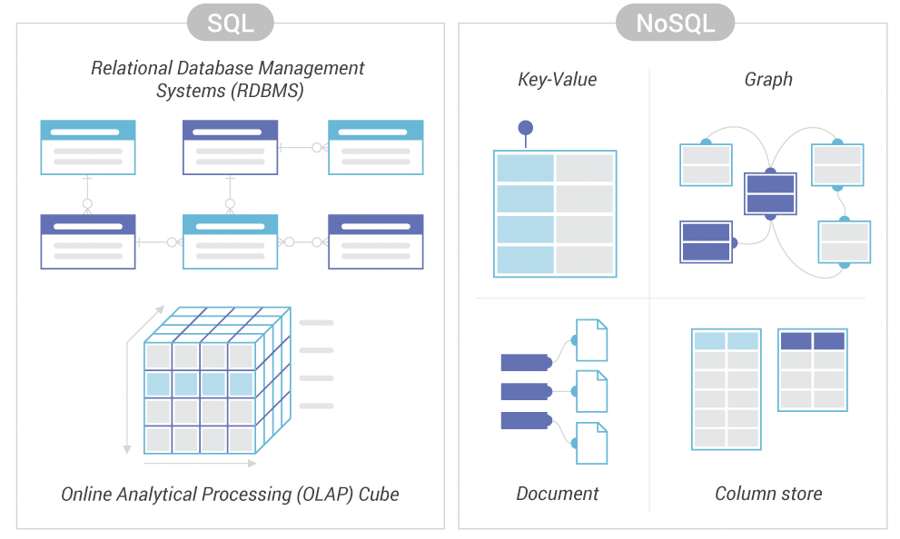

## **<u>Relational and Non-Relational Database</u>**
 
 

Relational databases have been around for a long time, but as technology progressed, database management systems required more than just the traditional relational model. The traditional relational model had many limitations, including data type restrictions, scalability, availability and performance, and as these limitations grew, new alternative models emerged, known as non-relational databases, also known as NoSQL databases. While we frequently compare models using conventional benchmarks, this frequently results in a comparison of two different use cases. The major distinction between relational and non-relational databases is that relational databases only employ structured data, but non-relational databases may use any sort of data, whether structured, unstructured, or semi-structured. Different non-relational models have their own set of benefits and drawbacks, and it is up to us to decide which model is best for our data.

 

* Key-Value databases
* columnar databases
* document-oriented databases
* graph databases 

 

### **Defining few NoSQL database models**
 

These are some of the most prevalent NoSQL databases. The data is stored in a single collection that is linked to a unique key that acts as an identifier for retrieving the data associated with that key. Whereas in a columnar database model, data is stored in columns in a record-based format, which provides for more efficient data access but has the downside of poor loading performance. The key difference is that in the document-oriented database model, each document is considered a uniquely identifying key that stores the data, whereas in the key-value model, each document is considered a uniquely identifying key that stores the data. The key difference is that in the document-oriented database model, there is some kind of metadata that allows us to understand the data within the document.

 

